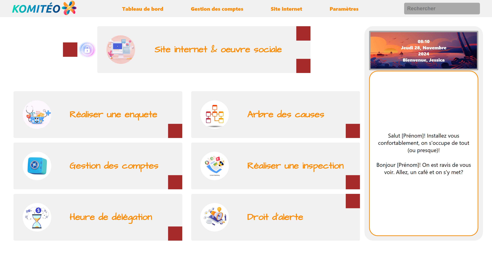
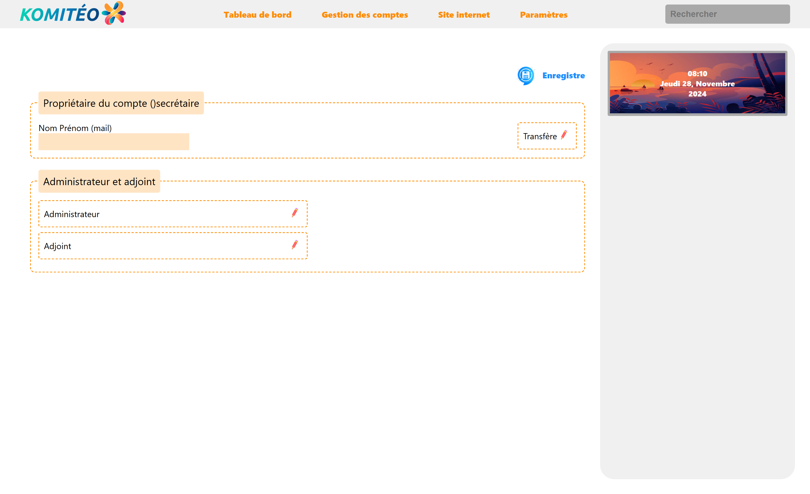
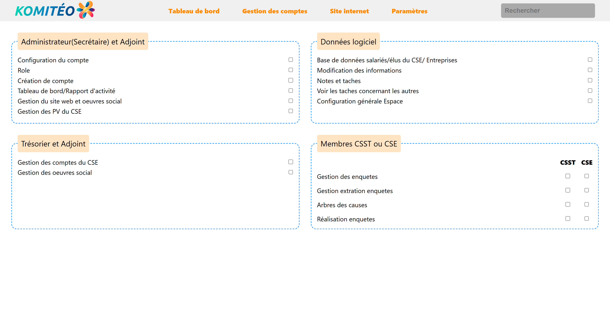
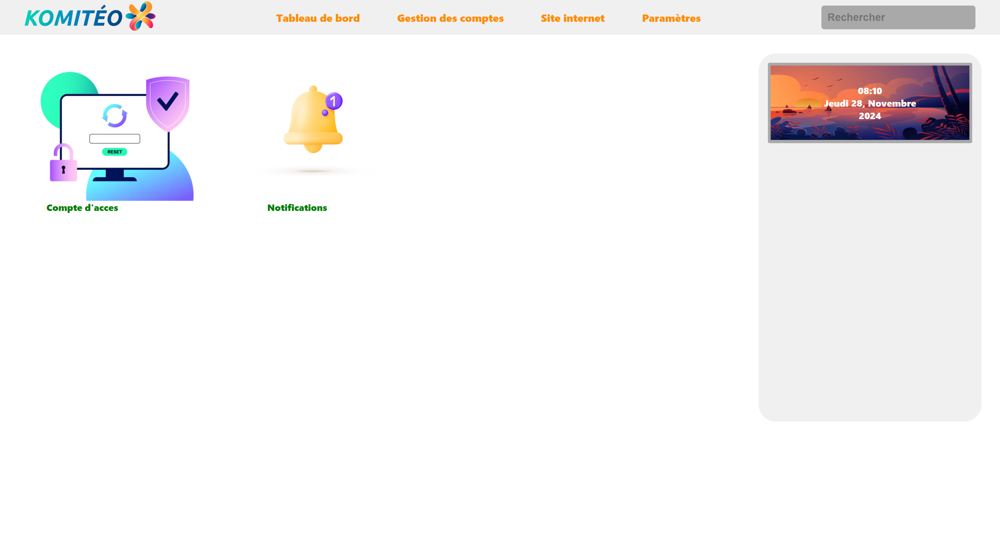

# Komiteo
This project is a submission for the code test by Komiteo, and is the implementation of mockups using HTML, CSS and a little bit of JavaScript.

Below is how the different pages look like on a CHROME BROWSER
## Home page

## Forms

## Setings/Parametres

